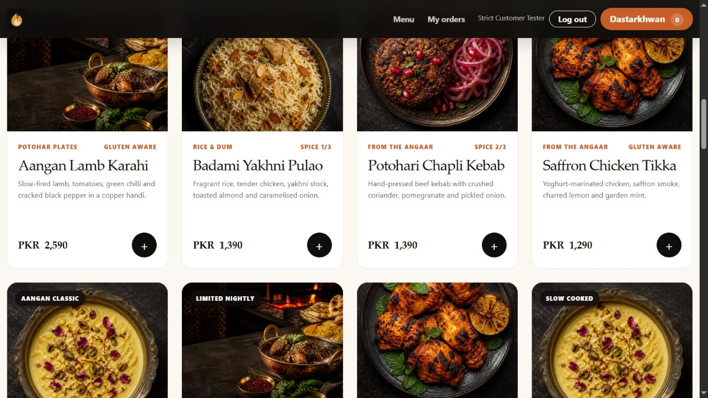
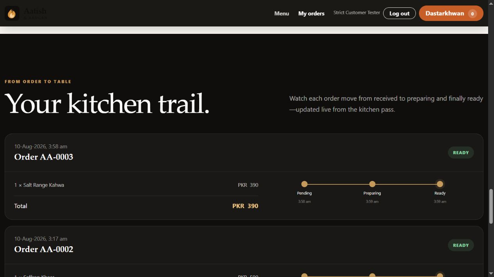
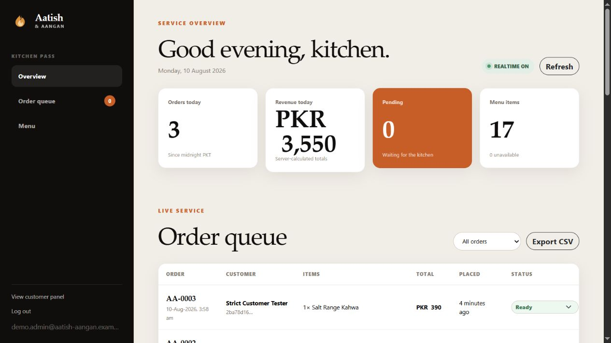
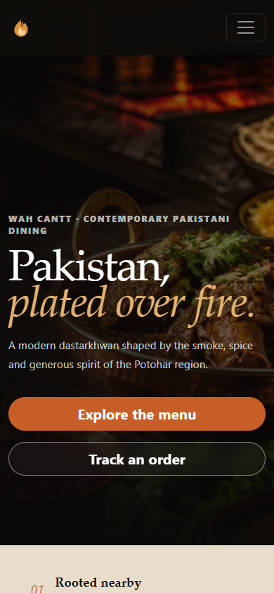

# Aatish & Aangan

**CloudExify Full Stack Web Development — Month 2, Project 4**

Aatish & Aangan is a fictional contemporary Pakistani live-fire restaurant in Wah Cantt. The application pairs an editorial fine-dining identity with a secure Supabase backend: customers can build a persistent dastarkhwan, place server-priced orders and follow the kitchen live, while approved admins manage the queue and menu from a protected dashboard.

| Project detail | Value |
| --- | --- |
| Student | Muzammil Hayat Minhas |
| Registration ID | CX-INT-2026-GEN-0195 |
| Category | Fine Dining |
| Location | Wah Cantt, Pakistan |
| Currency | PKR |
| Live application | [cloudexify-web-p4-muzammilminhas.vercel.app](https://cloudexify-web-p4-muzammilminhas.vercel.app) |
| Repository | [cloudexify-web-p4-muzammilminhas](https://github.com/muzzammilminhas/cloudexify-web-p4-muzammilminhas) |

## Product tour

### Live customer menu



### Realtime kitchen trail



### Protected kitchen dashboard



### Responsive mobile experience

<p align="center"></p>

## What is implemented

### Customer experience

- Supabase email registration, sign-in, sign-out and persistent sessions
- Automatic `customer` profile creation through an `auth.users` database trigger
- Live menu loaded from PostgreSQL with category filters, text search and four useful sort modes
- Persistent per-user cart with quantity controls, a quantity cap and polished off-canvas feedback
- Atomic order placement through a guarded database RPC
- Server-owned price snapshots and totals; browser-supplied prices are ignored
- Idempotency keys that prevent duplicate orders during retries or double actions
- Private order history with a Pending → Preparing → Ready timeline
- Realtime order and menu availability updates
- Loading, empty, cached-menu, offline and error states

### Admin experience

- Role-checked kitchen dashboard with a separate admin route
- Database-enforced admin authorization in addition to frontend routing
- Live incoming order queue, status filters and CSV export
- Exact forward-only Pending → Preparing → Ready workflow
- Menu create, edit, delete, feature and sold-out controls
- Live daily order, revenue, pending and menu statistics
- Responsive sidebar and touch-scrollable data tables

### Quality and design

- Bootstrap 5.3.8 with modular vanilla JavaScript ES modules
- Original responsive visual system, custom CSS and optimized WebP assets
- Semantic landmarks, skip links, visible focus states, descriptive controls and reduced-motion support
- Content Security Policy, anti-framing, MIME sniffing protection, limited browser permissions and immutable asset caching
- No lorem ipsum, dead controls, personal restaurant contact details or service-role secrets

## Security model

The browser contains only the Supabase publishable key. That key is expected to be public; it is safe here because PostgreSQL grants, Row Level Security and security-definer RPCs enforce the authorization boundary.

- `profiles`: customers can read only their own profile; admins can read all profiles. Clients cannot update roles.
- `orders`: customers can read only their own orders; admins can read all orders. Direct client inserts and updates are revoked.
- `menu_items`: authenticated users may read non-sensitive menu metadata so Realtime can announce sold-out changes. Only admins can insert, update or delete items.
- `place_order`: validates authentication, availability, quantities and current database prices inside one transaction.
- `admin_update_order_status`: checks the caller's database role and rejects skips, reversals and invalid states.
- Admin assignment is a deliberate server-side SQL operation. Registration can never request an admin role.
- The Supabase service-role key is not used, stored or exposed anywhere in this repository.

See [`supabase/schema.sql`](supabase/schema.sql) for the complete schema, grants, policies, triggers and RPC functions.

## Disposable reviewer accounts

Use the **Admin portal** option on the sign-in page.

```text
Admin email:    demo.admin@aatish-aangan.example
Admin password: Aangan-Demo!2026#Fire
```

An optional customer account contains completed order-history examples:

```text
Customer email:    test.customer@aatish-aangan.example
Customer password: Customer-Test!2026#Table
```

These are fictional, disposable grading accounts with no personal information. Because public admin credentials can change menu and order data, the admin password should be rotated or the account removed after assessment.

## Local setup

1. Create a Supabase project in a nearby region.
2. Run [`supabase/schema.sql`](supabase/schema.sql) in the SQL editor.
3. Run [`supabase/seed.sql`](supabase/seed.sql) to load the 17-dish evening menu.
4. Create customer and disposable admin users through Supabase Authentication.
5. Update the approved demo email in [`supabase/promote-demo-admin.sql`](supabase/promote-demo-admin.sql), review it, and run it once.
6. Put the project URL and **publishable/anon** key in [`js/config.js`](js/config.js). Never put the service-role key in browser code.
7. Serve the project through HTTP, for example:

   ```bash
   python -m http.server 4317
   ```

8. Add the local and production origins to Supabase Authentication redirect URLs.

No bundler or framework build is required.

## Deployment

The `main` branch is connected to Vercel. `vercel.json` supplies clean URLs, security headers and long-lived caching for optimized assets. Supabase Authentication is configured with:

- Site URL: `https://cloudexify-web-p4-muzammilminhas.vercel.app`
- Production redirect: `https://cloudexify-web-p4-muzammilminhas.vercel.app/**`
- Local redirects for `127.0.0.1:4317` and `localhost:4317`

## Verification summary

- Customer registration success state, login, logout and session refresh checked
- Customer/admin route restrictions checked locally and in production
- Customer RLS isolation and blocked role escalation checked with a real customer JWT
- Direct order insert, direct order update paths and admin RPC access denied to customers
- Server price override probe returned the real PKR 590 price instead of a supplied PKR 1 value
- Duplicate RPC submission returned one order and one database row
- Pending → Ready skip rejected; valid Pending → Preparing → Ready flow passed live
- Menu create, edit, sold-out, restore and delete propagated to the live customer menu
- Cart math, quantity changes, refresh persistence, empty state and offline checkout lock checked
- Mobile customer layout checked at 390 × 844; admin tablet behavior checked at 768 × 1024
- Production headers, optimized-asset caching and custom 404 checked
- Production browser run completed without page or console errors

Lighthouse production sign-in audit:

| Performance | Accessibility | Best Practices | SEO |
| ---: | ---: | ---: | ---: |
| 98 | 92 | 100 | 100 |

Additional measurements: FCP 1.7 s, LCP 2.2 s, CLS 0 and TBT 30 ms.

## Original visual assets

The hero and menu atlas were generated specifically for this fictional brand with OpenAI's built-in image generation tool, then cropped and optimized locally to responsive WebP files. No stock restaurant identity or Project 3 design assets were reused.

- Hero direction: cinematic Pakistani live-fire fine dining, copper handi, glowing charcoal grill, editorial night lighting and left-side text space, with no lettering or logos.
- Menu atlas direction: a coherent 2 × 2 overhead editorial food atlas featuring chicken tikka, chapli kebab, yakhni pulao and saffron kheer, with no lettering or logos.

## Disclaimer

Aatish & Aangan, its address, menu and contact-free restaurant information are entirely fictional and were created for the CloudExify internship assignment.
